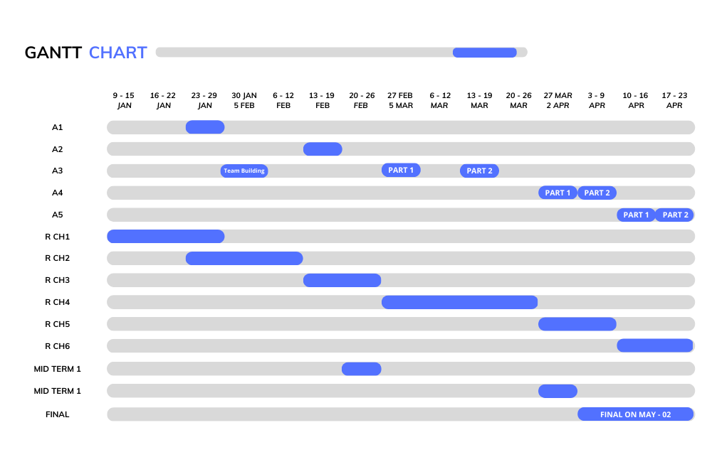

# CSE-445

<h2>CSE 445 Gannt chart</h2>

  

## Modules 
* [Week One](https://github.com/berrios96sean/CSE-445/tree/main/Week_One) 

## All Lecture Notes 
* [Lecture One](https://github.com/berrios96sean/CSE-445/blob/main/Week_One/Lecture_One_Notes.txt) 
